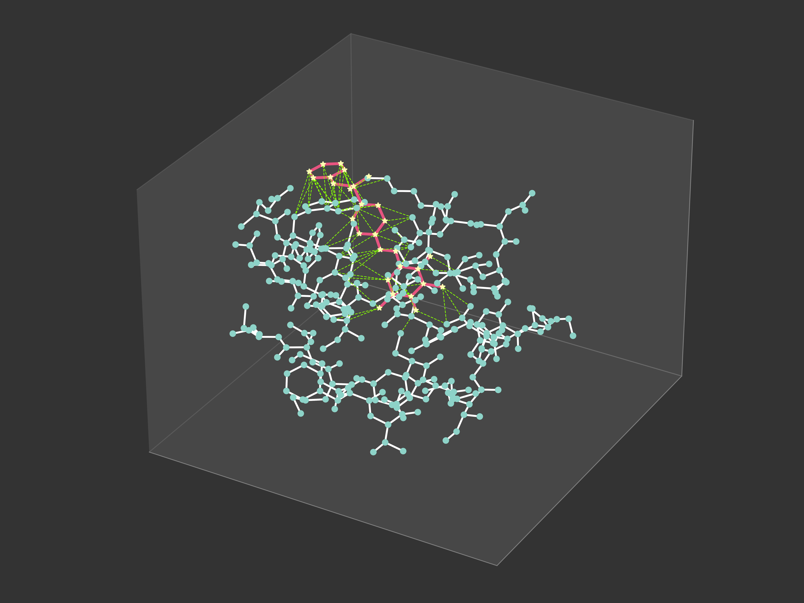

## SINGA - Molecular <ins>S</ins>ampling with Protein-Ligand <ins>IN</ins>teractions aware <ins>G</ins>enerative <ins>A</ins>dversarial Network

### This project is under progress. Coming soon.

Developer: OON Yu Yang (翁宇陽), Project Officer (Computational Biology || Biochemistry) at School of Biological Sciences, Nanyang Technological University (NTU), Singapore

Principal Investigator: **[Assoc Prof MU Yuguang](https://dr.ntu.edu.sg/cris/rp/rp00074?ST_EMAILID=YGMU)**

## Introduction


<p align="center">
    <em>Protein-ligand complex as a three-dimensional heterogeneous graph, with an emphasis on interactions between the protein and ligand.</em>
</p>

## Installation

Working inside a Conda virtual environment is hightly encouraged, but not necessary. Create a new environment with the command:

```
conda env create -f environment.yml
```

Otherwise, install the following dependencies sequentially.

```
conda create -n SINGA python=3.10
conda activate SINGA
conda install -c conda-forge openbabel
pip install --pre torch torchvision torchaudio --index-url https://download.pytorch.org/whl/cu121
pip install torch_geometric==2.3.1
pip install torch-scatter==2.1.1 torch-sparse==0.6.17
pip install biopandas==0.4.1 pytorch-lightning==2.0.6
pip install rdkit==2023.3.3
pip install oddt==0.7
pip install easydict==1.10
pip install e3nn==0.5.1
```

## Directory tree

```
  $ singa (main directory)
  .
  |
  |__ /autodock_vina
  |__ /ckpt
  |__ /config
  |__ /dataset
      |__ /crossdocked_graph10_v2
  |__ /example
  |__ /features
  |__ /img
  |__ /model
      |__ Discriminator.py
      |__ EF_embedding.py
      |__ EF_layers.py
      |__ GAN.py
      |__ Generator.py
      |__ Masking.py
  |__ /output
  |__ /utils
      |__ /ledock
      |__ __init__.py
      |__ Data.py
      |__ Featuriser.py 
      |__ misc.py
      |__ PLFeature.py
      |__ PLIExtension.py
      |__ PLInteraction.py
      |__ PLParser.py
      |__ redirect.py
  |__ .gitignore
  |__ __init__.py
  |__ environment.yml
  |__ LICENSE
  |__ MakeGraph.py
  |__ README.md
  |__ train.py
```

## License

MIT License

## Acknowledgement

Part of this codebase is adapted from [EquiformerV2](https://github.com/atomicarchitects/equiformer_v2) and [HGScore](https://github.com/KevinCrp/HGScore). Details of the adaptation are stated explicitly in the script.
